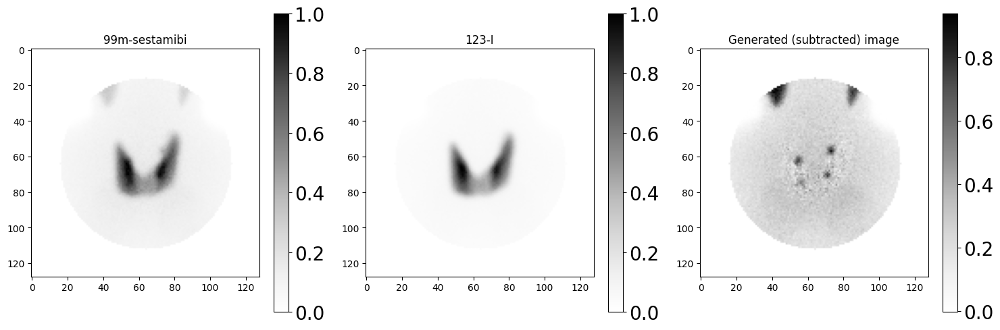

# NM-USNet: A Novel Generative Model for Parathyroid Glands Detection in Nuclear Medicine
[NM-USNet Architecture](Images/Methodologie.pdf)
This repository contains different codes of a generative model **NM-USNet** that is a combination of a **Siamese Network** and a **U-Net** model for parathyroid glands detection through automatic image subtraction using 123-I and 99m-Tc images. The combination of the two components is monitored with an optimized loss function that includes reconstruction error (MSE of the U-NET) and similarity computed by the SN, with dynamic weighting adjustment methodology.

---

## Needs to know

- **Siamese Network**: Learns to compute similarity scores between image pairs using a shared feature extraction architecture. It needs to be trained before pair of real images and correspending noise.
- **U-Net Architecture**: Performs image-to-image mapping for reconstruction tasks, with an encoder-decoder architecture.
- **Combined Loss**: Integrates U-Net loss (MSE) and Siamese Network loss, dynamically weighted by `alpha` and `beta`, weights of the **U-Net** and **Siamese Network**, respectively.
- **10-Fold Cross-Validation**: To assess the performance and robustness.
- **Custom Metrics**: Includes Pearson correlation as a validation metric.

---


## Install dependencies using:
```bash
pip install -r requirements.txt
```
---
## Example execution of NM-USNet
### Due to data privacy, this example image is generated using XCAT simind simulator

### A sample data of the synthetic ones are available in the folder Images, in numpy formats.
---
## An open science project regarding NM-USNet is in progress, it will be made available when it is set.

---
